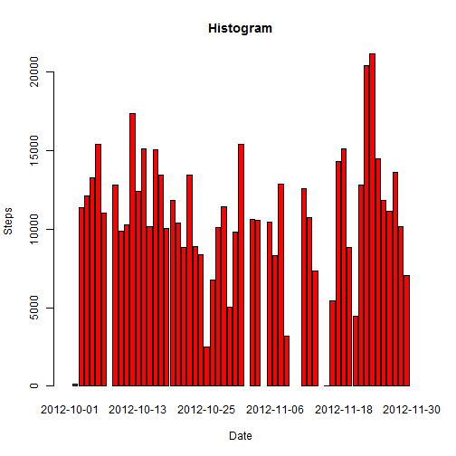
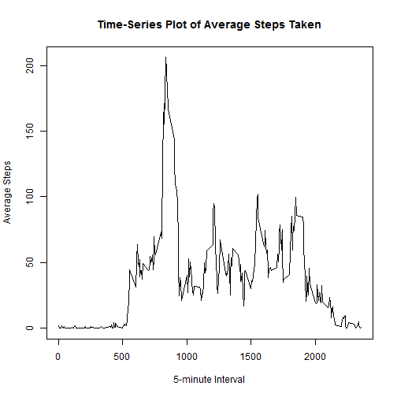
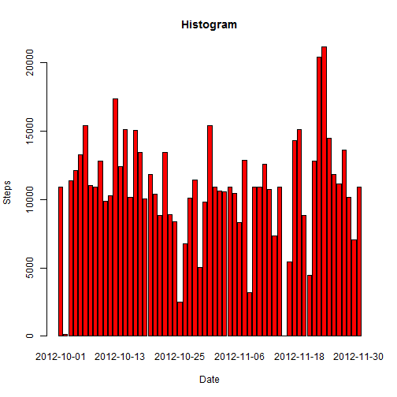
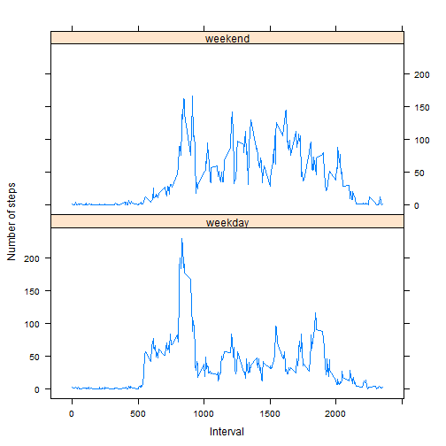

### Introduction
It is now possible to collect a large amount of data about personal movement using activity monitoring devices such as a [Fitbit](http://www.fitbit.com/), [Nike Fuelband](http://www.nike.com/us/en_us/c/nikeplus-fuelband), or [Jawbone Up](https://jawbone.com/up). These type of devices are part of the "quantified self" movement - a group of enthusiasts who take measurements about themselves regularly to improve their health, to find patterns in their behavior, or because they are tech geeks. But these data remain under-utilized both because the raw data are hard to obtain and there is a lack of statistical methods and software for processing and interpreting the data.

This assignment makes use of data from a personal activity monitoring device. This device collects data at 5 minute intervals through out the day. The data consists of two months of data from an anonymous individual collected during the months of October and November, 2012 and include the number of steps taken in 5 minute intervals each day.

### Data  

The data for this assignment can be downloaded from the course web site:

* Dataset: [Activity monitoring data](https://d396qusza40orc.cloudfront.net/repdata%2Fdata%2Factivity.zip) [52K]  

The variables included in this dataset are:

* steps: Number of steps taking in a 5-minute interval (missing values are coded as ```NA```)

* date: The date on which the measurement was taken in YYYY-MM-DD format

* interval: Identifier for the 5-minute interval in which measurement was taken

The dataset is stored in a comma-separated-value (CSV) file and there are a total of 17,568 observations in this dataset.

### Assignment

This assignment will be described in multiple parts. This is a report that answers the questions detailed below. Ultimately, the entire assignment is in a **single R markdown** document that can be processed by **knitr** and be transformed into an HTML file.

Throughout this report I ensure to always include the code that used to generate the output presented. When writing code chunks in the R markdown document, I always use ```echo = TRUE``` so that someone else will be able to read the code. **This assignment will be evaluated via peer assessment so it is essential that my peer evaluators are able to review the code used for my analysis**.

For the plotting aspects of this assignment, I used the base plotting system in R.

First I forked/cloned the [GitHub repository created for this assignment](http://github.com/rdpeng/RepData_PeerAssessment1). I submitted this assignment by pushing my completed files into my forked repository on GitHub. The assignment submission consists of the URL to my GitHub repository and the SHA-1 commit ID for my repository state.

NOTE: The GitHub repository also contains the dataset for the assignment so the data does not need to be downloaded separately.  Also, I assume that you've put the data into your working directory.

###Loading and preprocessing the data

First, load the data:

```r
data <- read.csv(file = "activity.csv",
                 header = TRUE,
                 sep = ",",
                 na.strings = "NA")
```
Process/transform the data (if necessary) into a format suitable for your analysis.

Since the dates were read in as factors they need to be transformed into dates

```r
data$date <-as.Date(data$date)
```

###What is the mean total number of steps taken per day?

For this part of the assignment it is allowed to ignore the mising values in the dataset.

1. Make a histogram of the total number of steps taken each day.


```r
total.steps.per.day <- aggregate(data$steps, list(data$date), sum)
colnames(total.steps.per.day) <- c("Date","Steps")
barplot(total.steps.per.day$Steps,
        col = "red",
        main = "Histogram",
        xlab = "Date",
        ylab = "Steps",
        names.arg=total.steps.per.day$Date)
```

 

2. Calculate and report the **mean** and **median** total number of steps taken per day.


```r
mean.steps <- mean(total.steps.per.day$Steps, na.rm = TRUE)
median.steps <- median(total.steps.per.day$Steps, na.rm = TRUE)
paste("The mean number of steps taken per day is ", mean.steps)
```

```
## [1] "The mean number of steps taken per day is  10766.1886792453"
```

```r
paste("The median number of steps taken per day is ",median.steps)
```

```
## [1] "The median number of steps taken per day is  10765"
```

###What is the average daily activity pattern?

1. Make a time series plot (i.e., ```type = "l"```) of the 5-minute interval (x-axis) and the average number of steps taken, averaged across all days (y-axis).


```r
intervals <- aggregate(data = data,
                       steps ~ interval,
                       FUN = mean,
                       na.action = na.omit)
colnames(intervals) <- c("Interval", "Avg.Steps")
with(intervals, {plot(x=Interval,
                      y=Avg.Steps,
                      type="l",
                      main="Time-Series Plot of Average Steps Taken",
                      xlab="5-minute Interval",
                      ylab="Average Steps")
                 })
```

 

2.  Which 5-minute interval, on average across all the days in the dataset, contains the maximum number of steps?


```r
The.Max <- intervals[intervals$Avg.Steps == max(intervals$Avg.Steps),]
paste("The 5-minute interval, ",The.Max$Interval,", has the maximum average number of steps [",
      The.Max$Avg.Steps," steps].")
```

```
## [1] "The 5-minute interval,  835 , has the maximum average number of steps [ 206.169811320755  steps]."
```

###Inputing missing values

Note that there are a number of days/intervals where there are missing values (coded as ```NA```).  The presence of missing days may introduce bias into some calculations or summaries of the data.

1. Calculate and report the total number of missing values in the dataset (i.e., the total number of rows with ```NA```s).


```r
missing <-sum(is.na(data$steps))
paste("The total number of missing values in the dataset is ", missing)
```

```
## [1] "The total number of missing values in the dataset is  2304"
```

2. Devise a strategy for filling in all of the missing values in the dataset.  The strategy does not need to be sophisticated.  For example, you could use the mean/median for that day, or the mean for that 5-minute interval, etc.

The average 5-minute interval values from the prevous section is used to replace the NA values of the original data and a new dataset will be generated from the latter.

3. Create a new dataset that is equal to the original dataset but with the missing data filled in.


```r
stepValues <- data.frame(data$steps)
stepValues[is.na(stepValues),] <- ceiling(tapply(X=data$steps,INDEX=data$interval,FUN=mean,na.rm=TRUE))
newData <- cbind(stepValues, data[,2:3])
colnames(newData) <- c("Steps", "Date", "Interval")
```

Now to do what we've done before to the new data so that we can

4. Make a histogram of the total number of steps taken each day and calculate and report the **mean** and **median** total number of steps taken per day. Do these values differ from the estimates from the first part of the assignment? What is the impact of imputing missing data on the estimates of the total daily number of steps?


```r
newDailyStepSum <- aggregate(newData$Steps, list(newData$Date), sum)
colnames(newDailyStepSum) <- c("Date","Steps")
barplot(newDailyStepSum$Steps,
        col = "red",
        main = "Histogram",
        xlab = "Date",
        ylab = "Steps",
        names.arg=newDailyStepSum$Date)
```

 

```r
mean.newsteps <- mean(newDailyStepSum$Steps, na.rm = TRUE)
median.newsteps <- median(newDailyStepSum$Steps, na.rm = TRUE)
paste("The mean number of steps taken per day is ", mean.newsteps)
```

```
## [1] "The mean number of steps taken per day is  10784.9180327869"
```

```r
paste("The median number of steps taken per day is ",median.newsteps)
```

```
## [1] "The median number of steps taken per day is  10909"
```

As you can see, adding in the values has increased both the mean and the median:

###Are there differences in activity patterns between weekdays and weekends?

For this part the ```weekdays()``` function may be of some help here. Use the dataset with the filled-in missing values for this part.

1. Create a new factor variable in the dataset with two levels - "weekday" and "weekend" indicating whether a given date is a weekday or a weekend day.


```r
dateDayType <- data.frame(sapply(X = newData$Date, FUN = function(day) {
    if (weekdays(as.Date(day)) %in% c("Monday", "Tuesday", "Wednesday", "Thursday", 
        "Friday")) {
        day <- "weekday"
    } else {
        day <- "weekend"
    }
}))

newData <- cbind(newData, dateDayType)

colnames(newData) <- c("Steps", "Date", "Interval", "DayType")
```

2. Make a panel plot containing a time series plot (i.e., ```type = "l"```) of the 5-minute interval (x-axis) and the average number of steps taken, averaged across all weekday days or weekend days (y-axis). See the README file in the GitHub repository to see an example of what this plot should look like using the simulated data. I had to use lattice for this...


```r
dayTypeIntervalSteps <- aggregate(data=newData, 
                                  Steps ~ DayType + Interval,
                                  FUN=mean)

library("lattice")

xyplot(type="l",
       data=dayTypeIntervalSteps,
       Steps ~ Interval | DayType,
       xlab="Interval",
       ylab="Number of steps",
       layout=c(1,2))
```

 
